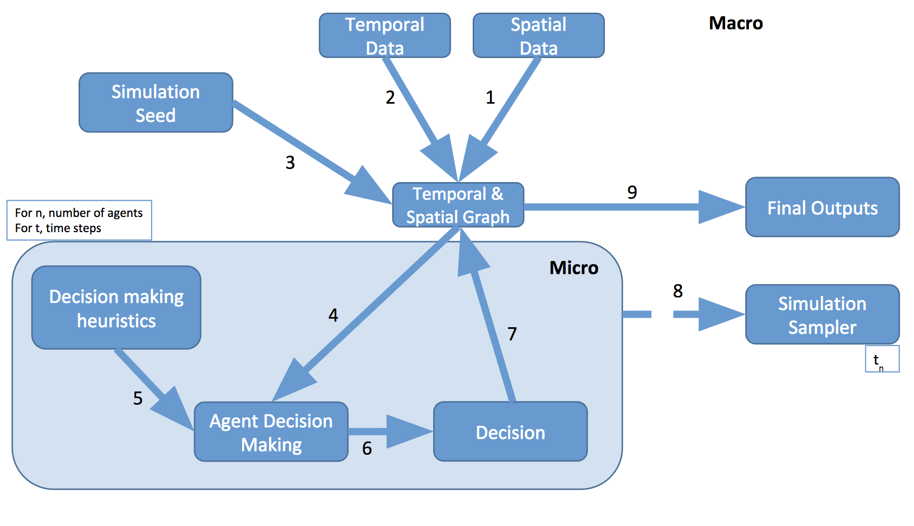

## Welcome to cb-cities

### About

cb-cities is a colloboration between the University of Cambridge and UC, Berkeley. We mostly work on dynamic simulations of urban systems, such as the transportation and water networks. 

<!--### Modelling framework

The modelling framework is shown below. 

1. [Networks](./networks.html)
2. [Modelling](./modelling.html)
3. [Visualisation](./visualisation.html)-->

### Publications

[A Scalable Agent Based Multi-modal Modeling Framework Using Real-Time Big-Data Sources for Cities](https://trid.trb.org/view/1439361), TRB, 2017.

### Team

Gerry Casey 
krishna Kumar 
Bing Zhao 
Kenichi Soga 

