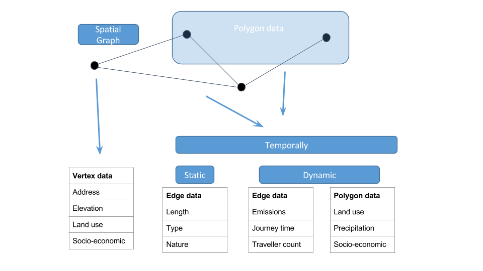

## Welcome to cb-cities

### About

cb-cities is a colloboration between the University of Cambridge and UC, Berkeley.

### Repositories

The modelling framework is shown below. 

#### Networks

Conceptually the networks describe the graph data strcuture, as shown below. .

1. [GTFS Graph Generation](https://github.com/cb-cities/gtfs_graph)
2. [GML explorer](https://github.com/cb-cities/gml-explorer)
s
#### Models
1. [ABM]()

### Contact

[Gerry Casey](mailto:gerard.casey@arup.com)
[krishna Kumar](mailto:kks32@cam.ac.uk)
[Bing Zhao](bz247@cam.ac.uk)

