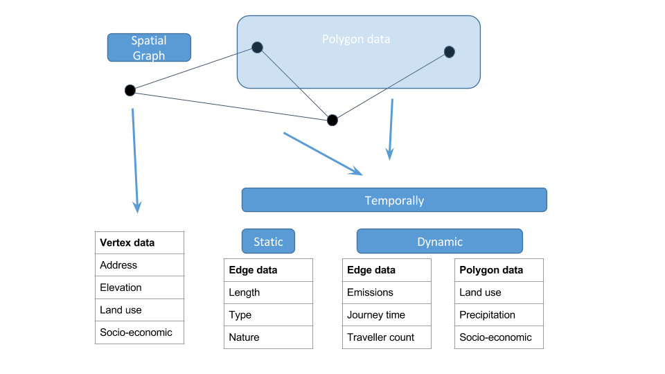
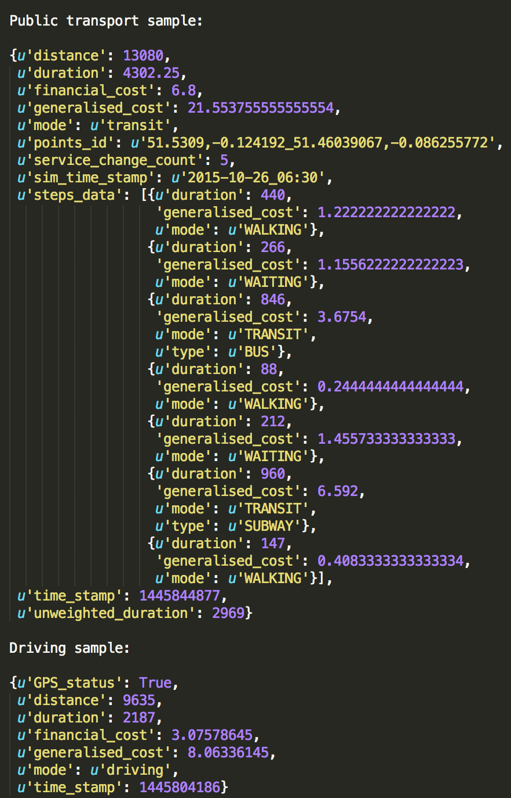

#### Networks

Conceptually the networks describe the graph data strcuture, as shown below. .

The outputted PT and road network objects are defined as shown below .

1. [GTFS Graph Generation](https://github.com/cb-cities/gtfs_graph)
2. [GML Explorer](https://github.com/cb-cities/gml-explorer)
3. [GML Directionality](https://github.com/cb-cities/gml-directionality)
4. [Temporal Weights](https://github.com/cb-cities/temporal_weights)
5. [TfL Feeds]()
6. [TfL GTFS]()